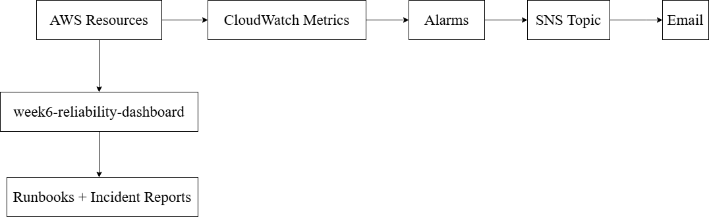
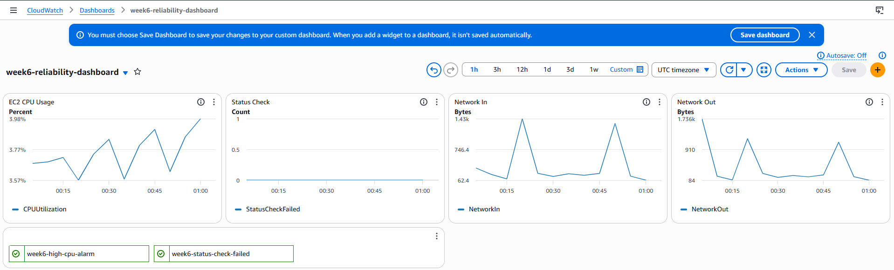
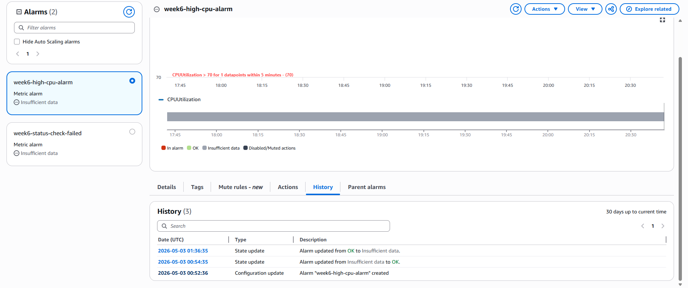

# AWS Week 6 - Observability and Reliability

## About
This project implements monitoring, alerting, and operational runbooks for AWS infrastructure using CloudWatch and SNS.

This observability layer was applied to the Week 5 Terraform-only environment. However, it is better to use Week 2 high-availability since the combination of ALB + ASG systems provides a richer signals, including target health, latency, request count, and auto-recovery behaviour. 

Week 6 focuses on operating and monitoring a live multi-component system.

---

## Objective
Move beyond deployment and demonstrate how cloud systems can be monitored, diagnosed, and operated under failure conditions.

---

## Architecture


---

## Metrics Monitored

---

## Dashboard



Dashboard name: `week6-reliability-dashboard`

Widgets include EC2 CPU, status checks, network I/O, ALB request
count, response time, healthy host count, and 5XX error rate.

---

## Failure Testing

### CPU Stress Test
Simulated high CPU by running a bash loop across multiple SSH sessions.

Result: CPUUtilization exceeded 70% threshold → alarm entered ALARM state → SNS email received within a few minutes.



---

## Future Improvements

- CloudWatch Agent for OS-level and application log shipping
- Log metric filters to alert on error patterns in logs
- Composite alarms to reduce alert noise
- Automated remediation via Lambda on alarm state change
- Distributed tracing with AWS X-Ray
- Centralised structured logging
- Anomaly detection alarms instead of static thresholds

---

## Repository Structure
```aws-week6-observability-reliability/
├── README.md
├── docs/
│   ├── runbooks/
│   │   ├── high-cpu-runbook.md
│   │   ├── unhealthy-targets-runbook.md
│   │   └── status-check-failure-runbook.md
│   ├── incident-reports/
│   │   └── cpu-alarm-test.md
│   └── architecture-diagram.png
└── screenshots/
├── cloudwatch-dashboard.png
├── cpu-alarm.png
└── alarm-history.png
```
